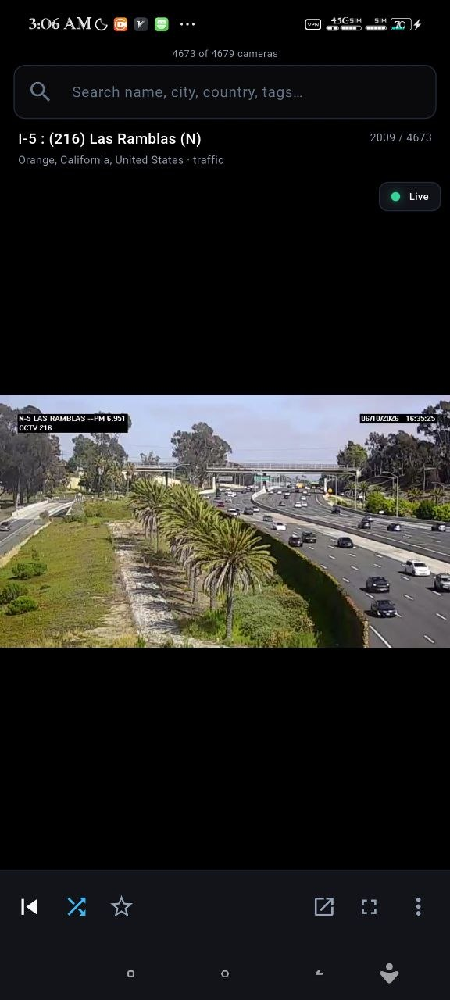
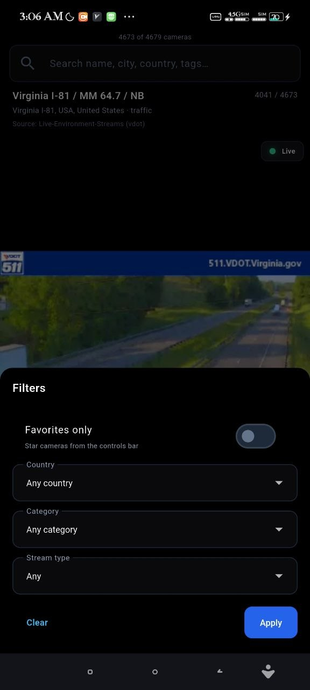
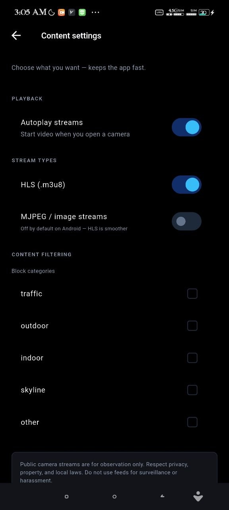
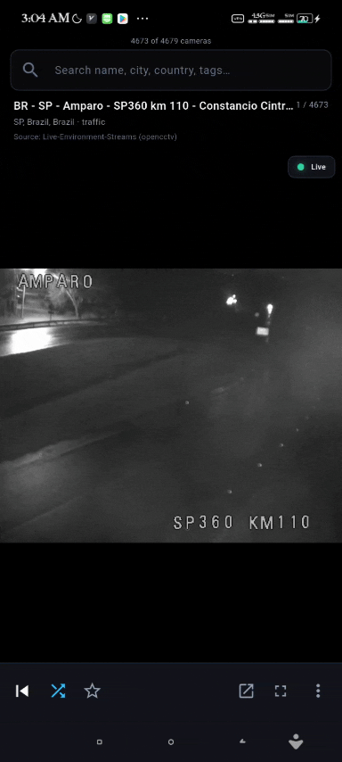

<p align="center">
  
</p>

<h1 align="center">Holes</h1>

<p align="center">
  Live public camera browser for Android — search, filter, favorites, random skip.<br>
  No map. No account. Catalog bundled offline.
</p>

<p align="center">
  <a href="https://github.com/Satan2049/holes/actions/workflows/ci.yml"></a>
  <a href="https://github.com/Satan2049/holes/releases"></a>
  <a href="LICENSE"></a>
  <a href="https://flutter.dev"></a>
</p>

---

## Description

**Holes** is an open-source Flutter app that browses a bundled catalog of **~4,700** documented public HTTPS live streams — traffic cams, city views, outdoor feeds, and more. Search by name or location, filter by country and stream type, star favorites, and skip broken feeds. Everything loads from local JSON at startup; no remote catalog fetch required.

Built for **Android** (recommended for HLS playback). A web build exists for UI preview; most HLS streams will not play in Chrome.

## Features

- **~4,700** bundled HTTPS live streams (HLS, YouTube embeds, MJPEG)
- Search by name, city, country, and tags
- Filters: country, category, stream type, favorites-only
- Random next / previous navigation
- Skip & hide bad feeds; bundled URL blocklist
- Stream health badge, fullscreen player, open in browser
- Onboarding: choose HLS/MJPEG preferences, block categories
- Remembers last camera and favorites locally — no account

## Screenshots

| Discover | Filters | Settings |
|:--------:|:-------:|:--------:|
|  |  |  |

## Demo

<p align="center">
  
</p>

## Installation

### Download release APK (recommended)

1. Open **[Releases](https://github.com/Satan2049/holes/releases/latest)** and download `app-release.apk`.
2. Copy to your Android device and install (enable sideloading if prompted).
3. On Xiaomi/MIUI, enable **Install via USB** in Developer options if installation fails.

### Verify the download

Before installing, confirm the APK matches the published checksum:

```powershell
# Windows
Get-FileHash -Path app-release.apk -Algorithm SHA256
```

Compare the output with [SHA256.txt](SHA256.txt). Full instructions: [docs/TRUST.md](docs/TRUST.md).

You can also scan the APK on [VirusTotal](https://www.virustotal.com/gui/file/9ec0d369aca28e0b981c453a9c08f18094cba762ce437aba1945d3e176983fe5?nocache=1) (v1.0.0 — clean, no malicious detections).

## Development

### Prerequisites

- [Flutter SDK](https://docs.flutter.dev/get-started/install) (stable)
- Android SDK for device builds
- Node.js (optional, for `scripts/` data pipeline)

### Run locally

```bash
flutter pub get
flutter run                  # Android — recommended for HLS video
flutter run -d chrome        # Web UI — most HLS will not play in Chrome
```

**After changing `assets/data/*.json`:** stop the app and do a **full restart** (not hot reload).

### Tests & analysis

```bash
flutter analyze
flutter test
```

See [docs/instructions.md](docs/instructions.md) for icon/splash regeneration, Android network workarounds, and architecture entry points.

## Build

### Release APK

```bash
flutter build apk --release
```

Output: `build/app/outputs/flutter-apk/app-release.apk`

### Update release checksums

Place release artifacts in `releases/` (or build first), then:

```powershell
.\scripts\generate-sha256.ps1 -IncludeBuildOutputs
```

Commit the updated [SHA256.txt](SHA256.txt) alongside the GitHub release.

### Data pipeline

```bash
node scripts/build-v1-dataset.mjs    # Rebuild v1 dataset
```

See [docs/DATA.md](docs/DATA.md) for schema and curation rules.

## Tech stack

| Layer | Technology |
|-------|------------|
| UI | Flutter / Material 3 |
| Video | `video_player` (HLS), `Image.network` (MJPEG) |
| Preferences | `shared_preferences` |
| External links | `url_launcher`, `webview_flutter` |
| Data | Bundled JSON under `assets/data/` |
| CI | GitHub Actions (`flutter analyze`, `flutter test`) |

## Ethics

Only **documented public** streams you may link. Use feeds for observation only — respect privacy, property, and local laws. Stream rights remain with their respective owners; this app only links to public URLs in the dataset.

## Documentation

| Document | Purpose |
|----------|---------|
| [docs/instructions.md](docs/instructions.md) | Developer setup and build |
| [docs/TRUST.md](docs/TRUST.md) | Verify SHA256 and scan with VirusTotal |
| [docs/DATA.md](docs/DATA.md) | Camera data schema and pipeline |
| [CONTRIBUTING.md](CONTRIBUTING.md) | How to contribute |
| [SECURITY.md](SECURITY.md) | Report security issues |

Project homepage (GitHub Pages): [docs/index.html](docs/index.html)

## License

MIT — see [LICENSE](LICENSE).

Camera stream rights remain with their respective owners; this project only links to public URLs documented in the bundled dataset.
