# Holes — Improvement plan (no new cameras)

> **v1 camera data is complete** (~5,990 enabled across 3 shards). Rebuild: `node scripts/build-v1-dataset.mjs`. See [DATA.md](./DATA.md).

This document captures planned **app** improvements that do **not** require sourcing new camera URLs. Work is grouped by area, with rationale, implementation notes, affected files, and actionable todos.

**Related:** [todo.md](./todo.md) (short checklist) · [roadmap.md](./roadmap.md) (milestones) · [DATA.md](./DATA.md) (data curation)

---

## Goals

1. **Fewer bad feeds** — drop snapshot-style streams, block known-dead URLs, surface health clearly.
2. **Better browsing** — favorites, skip bad feed, resume last camera, clearer empty states.
3. **Better playback** — faster MJPEG refresh, open-in-browser on Android, optional fullscreen.
4. **Stay fast** — smaller default dataset behavior, lazy/split data if the list grows again.
5. **Polish & trust** — branded splash, release APK workflow, ethics copy, source attribution.

---

## Phase overview

| Phase | Focus | Outcome |
|-------|--------|---------|
| **P0** | Data quality + playback basics | HLS-first list, blocklist, MJPEG cap, open in browser on Android |
| **P1** | Browsing UX | Favorites, skip bad feed, stream health badge, remember last camera |
| **P2** | Performance & scale | Split/lazy JSON, onboarding defaults, empty-state actions |
| **P3** | Polish & release | Native splash, release APK docs, settings ethics note, attribution UI |

---

## 1. Data quality

### 1.1 Prune to HLS-only (HTTPS)

**Problem:** ~4,100 of ~7,029 bundled cameras are `IMAGE_STREAM` (MJPEG/snapshot). Many refresh every 2–60 minutes and look like still photos. Only ~2,900 are HLS (real video).

**Plan:**

1. Run the existing prune script on `assets/data/cameras.json`.
2. Commit the smaller file; document expected counts in [DATA.md](./DATA.md).
3. Optionally keep a full backup outside the repo or in `assets/data/cameras.full.json` (gitignored) for re-import experiments.

**Commands:**

```bash
# Live video only (~2,926 cameras)
node scripts/prune-cameras.mjs --hls-only

# Live video + HTTPS only (~2,626 cameras)
node scripts/prune-cameras.mjs --hls-only --https-only

# Cap size while testing
node scripts/prune-cameras.mjs --hls-only --https-only --max 500
```

**After change:** full app restart (not hot reload).

**Files:** `scripts/prune-cameras.mjs`, `assets/data/cameras.json`, `docs/DATA.md`

**Todos:**

- [ ] **DQ-1** Run `--hls-only --https-only` and verify Android playback quality on a sample of 20 random cams
- [ ] **DQ-2** Record before/after counts in `DATA.md`
- [ ] **DQ-3** Decide whether to keep a full backup JSON (optional, gitignored)

---

### 1.2 Blocklist for known-bad URLs

**Problem:** Random skip often lands on dead, geo-blocked, or permanently offline feeds. Users waste time on streams that will never play.

**Plan:**

1. Add `assets/data/blocklist.json`:

```json
{
  "version": 1,
  "urls": [
    "https://example.com/dead-cam.m3u8"
  ],
  "ids": [
    "otc-Alabama-Mobile-0-66822133"
  ],
  "reasons": {
    "otc-Alabama-Mobile-0-66822133": "offline since 2026-03"
  }
}
```

2. Load blocklist in `CameraDataService` (or a small `BlocklistService`).
3. Filter blocked entries in `ContentFilterService.apply()` **after** prefs/filters.
4. Allow **session blocklist** in memory (see §2.2) merged with bundled blocklist at filter time.
5. Optional: persist session blocks to `shared_preferences` as “hide until restart” or permanent user block.

**Files:**

| File | Change |
|------|--------|
| `assets/data/blocklist.json` | New — curated dead URLs/ids |
| `lib/services/blocklist_service.dart` | New — load JSON + runtime set |
| `lib/services/camera_data_service.dart` | Apply blocklist after load |
| `lib/services/content_filter_service.dart` | Exclude blocked ids/urls |
| `pubspec.yaml` | Register `assets/data/blocklist.json` |
| `docs/DATA.md` | Document blocklist format |

**Todos:**

- [ ] **DQ-4** Define `blocklist.json` schema and add empty starter file
- [ ] **DQ-5** Implement `BlocklistService` (bundled + in-memory session ids)
- [ ] **DQ-6** Wire into filter pipeline; log blocked count in debug only
- [ ] **DQ-7** Add “Block this camera” action that appends id to session blocklist (pairs with §2.2)

---

## 2. Browsing UX

### 2.1 Favorites

**Problem:** No way to return to cameras you liked without random skip.

**Plan:**

1. Store favorite camera ids in `shared_preferences` (`Set<String>` JSON).
2. Add star icon on browse screen (toolbar or overlay on stream).
3. Add “Favorites only” toggle in `FilterSheet`.
4. When favorites filter is on and list is empty, show empty state with link to clear filter.

**Data model:**

```dart
// UserPreferences or separate FavoritesService
Set<String> favoriteCameraIds;
```

**Files:**

| File | Change |
|------|--------|
| `lib/services/favorites_service.dart` | New — load/save/toggle |
| `lib/screens/browse_screen.dart` | Star button, filter integration |
| `lib/widgets/filter_sheet.dart` | “Favorites only” switch |
| `lib/models/user_preferences.dart` | Optional: `favoritesOnly` filter flag (or keep in `BrowseFilters`) |

**Todos:**

- [ ] **UX-1** Implement `FavoritesService` with `shared_preferences`
- [ ] **UX-2** Star toggle on current camera in browse UI
- [ ] **UX-3** “Favorites only” in filter sheet + empty state

---

### 2.2 Skip bad feed (session block)

**Problem:** Dead or low-quality streams require many random skips to escape.

**Plan:**

1. Add **“Skip & hide”** button (visible on error overlay and optionally on controls bar).
2. On tap: add current camera `id` to session blocklist (§1.2), call `_next()` immediately.
3. Optional snackbar: “Hidden for this session” with Undo (5s).
4. Later: “Always hide” writes to persistent user blocklist in prefs.

**Files:** `browse_screen.dart`, `stream_player.dart` (error overlay action), `blocklist_service.dart`

**Todos:**

- [ ] **UX-4** “Skip & hide” on stream error state
- [ ] **UX-5** Optional control-bar button when stream is playing but user wants to banish feed
- [ ] **UX-6** Undo snackbar for session blocks

---

### 2.3 Stream health badge

**Problem:** Blank or frozen frames give no feedback — user cannot tell loading vs dead vs snapshot.

**Plan:**

1. Expose player state from `StreamPlayer` via callback or `ValueNotifier`:
   - `loading` | `playing` | `error` | `snapshot` (MJPEG mode)
2. Small badge top-right of player:
   - **Live** — green dot + “Live” (HLS playing)
   - **Refreshing** — blue pulse + “Snapshot” (MJPEG)
   - **Error** — red + “Unavailable”
   - **Loading** — subtle spinner text
3. For MJPEG with long `updateRateMs`, badge text: “Updates every Xm”.

**Files:** `lib/widgets/stream_player.dart`, `lib/screens/browse_screen.dart`

**Todos:**

- [ ] **UX-7** Define `StreamHealth` enum and emit from `StreamPlayer`
- [ ] **UX-8** `StreamHealthBadge` widget (minimal, theme-aligned)
- [ ] **UX-9** Show update interval hint for slow MJPEG

---

### 2.4 Remember last camera

**Problem:** App always starts at index 0 after restart.

**Plan:**

1. On camera change, persist `lastCameraId` to `shared_preferences`.
2. On load, find index of `lastCameraId` in filtered list; if missing, fall back to 0.
3. Respect filters: if last camera is filtered out, use first visible or clear last id.

**Files:** `preferences_service.dart`, `browse_screen.dart`

**Todos:**

- [ ] **UX-10** Save `lastCameraId` on index change
- [ ] **UX-11** Restore on `_loadCameras` / `_applyFilters` completion

---

## 3. Playback

### 3.1 Faster MJPEG refresh cap

**Problem:** Many OTC entries set `updateRateMs` to 120000–3600000 ms. The app honors that interval, so images look frozen for minutes or hours.

**Plan:**

1. In `StreamPlayer`, cap refresh interval:

```dart
final raw = cam.updateRateMs ?? 1500;
final ms = raw.clamp(800, 10000); // max 10s refresh in-app
```

2. Show badge “Source updates every Xm” when `raw > ms` so user knows we’re polling faster than the upstream snapshot rate (may show duplicate frames — acceptable).

**Files:** `lib/widgets/stream_player.dart`, `lib/utils/stream_utils.dart`

**Todos:**

- [ ] **PB-1** Cap MJPEG timer with configurable max (default 10s)
- [ ] **PB-2** Badge/note when capped vs upstream rate

---

### 3.2 Open in browser (Android + iOS)

**Problem:** `Open stream in browser` exists on web errors only. Android users with failed HLS or odd MJPEG cannot fall back.

**Plan:**

1. Show **Open in browser** on all platforms when `StreamPlayer` hits error (or always as secondary action in overflow menu).
2. Use existing `url_launcher` with `LaunchMode.externalApplication`.
3. Add toolbar icon `open_in_new` on browse controls bar.

**Files:** `lib/widgets/stream_player.dart`, `lib/screens/browse_screen.dart`

**Todos:**

- [ ] **PB-3** Remove `PlatformPlayback.isWeb` guard on open-in-browser button
- [ ] **PB-4** Add optional always-visible “Open externally” in controls bar

---

### 3.3 Landscape fullscreen (optional)

**Problem:** Video is letterboxed in portrait; traffic cams are often widescreen.

**Plan:**

1. Tap stream area → toggle immersive fullscreen (landscape preferred).
2. Use `SystemChrome.setEnabledSystemUIMode` + `OrientationBuilder` or `SystemChrome.setPreferredOrientations`.
3. Exit on back gesture or second tap.

**Files:** new `lib/widgets/fullscreen_player.dart` or extend `browse_screen.dart`

**Todos:**

- [ ] **PB-5** Fullscreen route or overlay with landscape lock
- [ ] **PB-6** Restore orientation/system UI on exit

---

## 4. Performance

### 4.1 Default to HLS-only on Android (onboarding)

**Problem:** New users get MJPEG + HLS; most MJPEG feeds look poor.

**Plan:**

1. On first launch, if `!kIsWeb`, default `allowMjpeg: false`, `allowHls: true`.
2. Web keeps MJPEG-friendly defaults (HTTPS image feeds).
3. Copy in onboarding: “Recommended on Android: HLS only (live video).”

**Files:** `lib/models/user_preferences.dart`, `lib/screens/onboarding_screen.dart`, `lib/screens/root_screen.dart`

**Todos:**

- [ ] **PF-1** Platform-specific default prefs in `UserPreferences.defaults()`
- [ ] **PF-2** Onboarding subtitle explaining HLS recommendation

---

### 4.2 Lazy-load / split `cameras.json`

**Problem:** ~7k entries (~3.4 MB JSON) loads entirely at startup; will worsen as more regions are added.

**Plan (choose one when needed):**

**Option A — Shard by region (recommended):**

```
assets/data/cameras/index.json     # { "shards": ["us-east.json", "us-west.json"] }
assets/data/cameras/us-east.json
```

- `CameraDataService` loads index, then shards on demand or loads all shards in isolate.
- Filter sheet country list from index metadata without loading all streams.

**Option B — Lazy single file:**

- Parse JSON in isolate (`compute()`).
- Defer parse until after first frame (splash).

**Option C — Build flavors:**

- `cameras.full.json` vs `cameras.lite.json` selected at build time.

**Files:** `camera_data_service.dart`, `scripts/split-cameras.mjs` (new), `DATA.md`

**Todos:**

- [ ] **PF-3** Benchmark cold start with current 7k file on target device
- [ ] **PF-4** If >2s parse, implement Option A or B
- [ ] **PF-5** Add `scripts/split-cameras.mjs` by state/country from OTC metadata

---

## 5. Polish

### 5.1 Branded splash (`flutter_native_splash`)

**Problem:** Launch shows plain black screen; icon polish not visible at startup.

**Plan:**

1. Add `flutter_native_splash` dev dependency.
2. Config: black background `#000000`, centered `assets/icon/app_icon.png`, no Android 12 animation clutter (minimal).
3. Run `dart run flutter_native_splash:create` after icon changes.

**pubspec snippet:**

```yaml
flutter_native_splash:
  color: "#000000"
  image: assets/icon/app_icon.png
  android_12:
    color: "#000000"
    image: assets/icon/app_icon.png
```

**Files:** `pubspec.yaml`, generated native splash assets

**Todos:**

- [ ] **PL-1** Add `flutter_native_splash` and config
- [ ] **PL-2** Generate splash; verify on Android cold start

---

### 5.2 Release APK (no terminal for daily use)

**Problem:** `flutter run` ties users to a dev machine and terminal.

**Plan:**

1. Document release build in [instructions.md](./instructions.md):

```bash
flutter build apk --release
# Output: build/app/outputs/flutter-apk/app-release.apk
```

2. Copy APK to phone; install once. No terminal needed after that.
3. Optional: `flutter build appbundle` for Play Store later.

**Todos:**

- [ ] **PL-3** Document release APK path in instructions.md
- [ ] **PL-4** Add signing notes placeholder (debug signing OK for personal use)

---

### 5.3 Empty states with clear actions

**Problem:** “All cameras hidden by filters” only offers settings; no one-tap fixes.

**Plan:**

1. When `_filtered.isEmpty` && `_all.isNotEmpty`, show action chips:
   - **Clear filters**
   - **Show HLS only** (sets stream type filter + re-applies)
   - **Open content settings**
2. When search query active, add **Clear search**.

**Files:** `lib/screens/browse_screen.dart`

**Todos:**

- [ ] **PL-5** Redesign `_emptyState()` with `ActionChip` / `FilledButton.tonal` actions
- [ ] **PL-6** “Show HLS only” sets `BrowseFilters(streamTypeOnly: StreamType.hls)`

---

## 6. Trust & ethics

### 6.1 “Public streams only” note in settings

**Plan:**

1. Add static section at bottom of onboarding/settings:
   - “Holes links only to documented public streams. Do not use for unauthorized surveillance.”
2. Link to `docs/DATA.md` or in-app `showLicensePage` / simple markdown dialog optional.

**Files:** `onboarding_screen.dart`, optional `lib/widgets/ethics_notice.dart`

**Todos:**

- [ ] **TE-1** Add ethics copy to settings screen
- [ ] **TE-2** Mirror short line in README Ethics section

---

### 6.2 Per-camera source attribution

**Plan:**

1. Extend camera schema (optional fields):

```json
{
  "source": "OpenTrafficCamMap",
  "sourceUrl": "https://github.com/AidanWelch/OpenTrafficCamMap",
  "attribution": "Alabama DOT via OTC"
}
```

2. Show one line under location in browse UI when `attribution` or `source` present.
3. `convert_otc.mjs` can set `source: "OpenTrafficCamMap"` by default.

**Files:** `lib/models/camera.dart`, `browse_screen.dart`, `scripts/convert_otc.mjs`, `AGENT.md`

**Todos:**

- [ ] **TE-3** Add optional `source`, `sourceUrl`, `attribution` to model + AGENT.md
- [ ] **TE-4** Display attribution line in browse metadata row
- [ ] **TE-5** Backfill OTC import with default `source`

---

## Master todo checklist

Copy unchecked items to [todo.md](./todo.md) as work starts. IDs match sections above.

### P0 — Data & playback

- [ ] DQ-1 Prune HLS + HTTPS and verify playback sample
- [ ] DQ-2 Update DATA.md counts
- [ ] DQ-4–DQ-7 Blocklist JSON + service + skip-hide
- [ ] PB-1–PB-2 MJPEG refresh cap
- [ ] PB-3–PB-4 Open in browser on Android

### P1 — Browsing

- [ ] UX-1–UX-3 Favorites
- [ ] UX-4–UX-6 Skip bad feed
- [ ] UX-7–UX-9 Stream health badge
- [ ] UX-10–UX-11 Remember last camera

### P2 — Performance & UX polish

- [ ] PF-1–PF-2 HLS-default onboarding on Android
- [ ] PF-3–PF-5 Split/lazy data (if benchmark warrants)
- [ ] PL-5–PL-6 Empty state actions

### P3 — Release & trust

- [ ] PL-1–PL-2 Native splash
- [ ] PL-3–PL-4 Release APK docs
- [ ] PB-5–PB-6 Fullscreen (optional)
- [ ] TE-1–TE-5 Ethics + attribution

---

## Implementation order (recommended)

```mermaid
flowchart LR
  A[DQ-1 Prune HLS] --> B[PB-1 MJPEG cap]
  B --> C[PB-3 Open browser]
  C --> D[UX-4 Skip hide]
  D --> E[DQ-4 Blocklist]
  E --> F[UX-1 Favorites]
  F --> G[UX-7 Health badge]
  G --> H[UX-10 Last camera]
  H --> I[PL-5 Empty actions]
  I --> J[PF-1 HLS default]
  J --> K[PL-1 Splash]
  K --> L[TE-1 Ethics]
```



Start with **prune + MJPEG cap + open in browser** for the biggest perceived quality win with least code.

---

## v2 — Streamer feeds (deferred)

> **Status:** Documented for next version. Not implementing in v1.

Holes v1 is **public webcam browsing** (offline JSON catalog). Streamer / creator feeds are a separate content type with different playback, APIs, and policy constraints.

### What already works (manual only)

Add YouTube streamers to any shard with `streamType: "youtube"`. Example in `wind_cameras.json`. Offline channels may show VOD — no live detection yet.

### v2 goals

| ID | Goal | Approach |
|----|------|----------|
| **ST-1** | Streamer shard | `assets/data/streamers.json` — id, name, platform, channel URL, tags, attribution |
| **ST-2** | Live-only browse | Script or backend: YouTube Data API (`liveBroadcastContent`), Twitch Helix (`streams?user_login=`) → set `enabled` or `isLive` |
| **ST-3** | Twitch playback | `streamType: twitch` + embed player (parent domain, TOS-compliant) |
| **ST-4** | Kick / others | `embed` WebView or HLS if platform exposes a stable URL |
| **ST-5** | Filter “Live streamers” | Browse filter + category `streamer` or tag |
| **ST-6** | In-app add streamer | Optional: paste channel URL → save to user list (SharedPreferences), not bundled JSON |
| **ST-7** | Broadcast from app | **Out of scope** unless pivoting to a publisher platform (ingest, moderation, legal) |

### Constraints

- Platform APIs require keys and periodic network refresh (breaks pure offline catalog unless cached).
- Twitch/Kick embed and API use are subject to platform terms.
- Ethics copy in onboarding should extend to creator streams (permission, harassment, minors).

### Recommended v2 order

1. **ST-1** — static YouTube streamer shard (no API)
2. **ST-2** — live refresh script run at build/CI time
3. **ST-3** — Twitch player
4. **ST-5** — browse filter
5. **ST-6** — user-added channels (optional)

---

## Out of scope (this doc)

- Sourcing new camera URLs or regions
- Re-adding map view
- Remote feed fetch on startup (except v2 streamer live refresh — see ST-2)
- VPN / geo-unblock features
- v2 streamer features (see section above) — tracked in [todo.md](./todo.md)

See [discovery.md](./discovery.md) for manual research tools when you *do* add cameras later.
